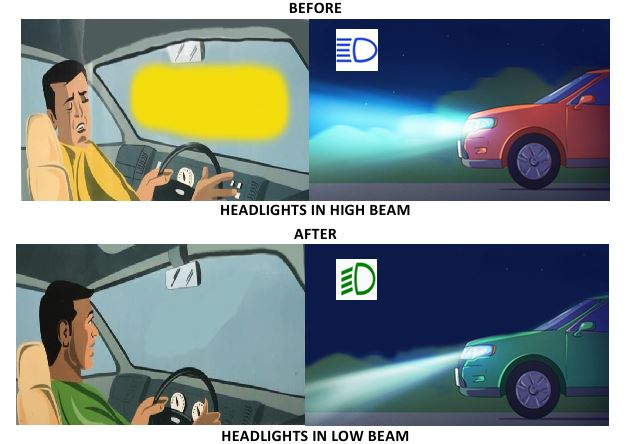
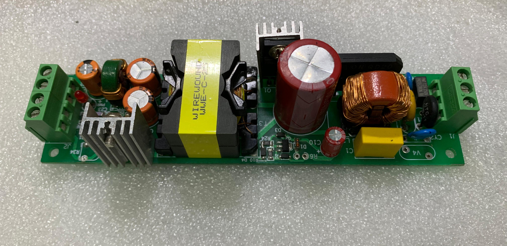
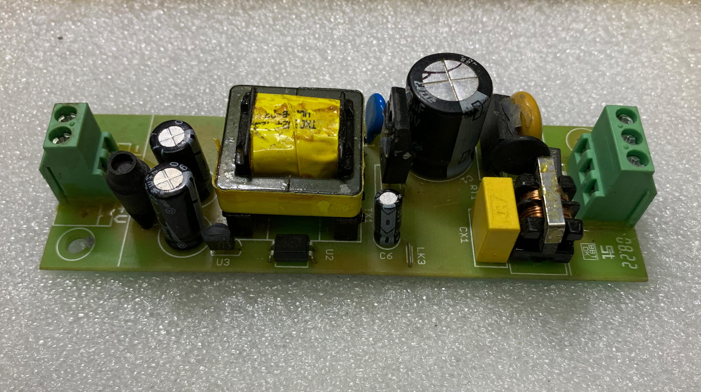
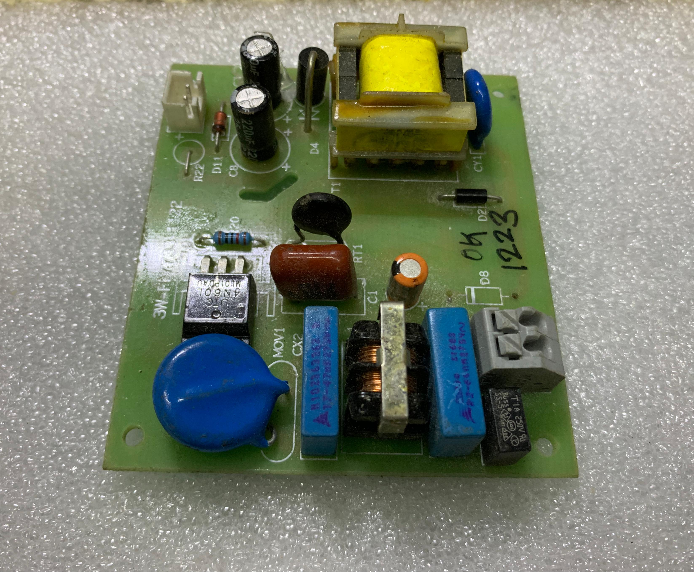
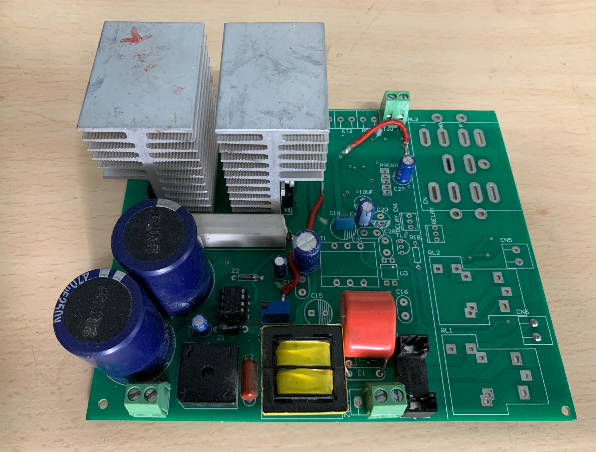

<!doctype html>
<html lang="en">
<head>
  <meta charset="utf-8" />
  <meta name="viewport" content="width=device-width, initial-scale=1" />
  <title>Tantronics Industries LLP – Electronics • Automation • Embedded Systems • Power Electronics • Medicare</title>
  <meta name="description" content="Tantronics Industries LLP delivers innovative electronics: embedded systems, power electronics, IoT and custom R&D-driven products for industry." />
  <meta name="theme-color" content="#181818" />

  <!-- Fonts & Icons -->
  <link rel="preconnect" href="https://fonts.gstatic.com" crossorigin>
  <link href="https://fonts.googleapis.com/css2?family=Inter:wght@300;400;600;800&display=swap" rel="stylesheet">
  <link rel="stylesheet" href="https://cdnjs.cloudflare.com/ajax/libs/font-awesome/6.5.0/css/all.min.css" crossorigin="anonymous" referrerpolicy="no-referrer" />
  <link rel="icon" type="image/png" href="./static/Tantronics Logo.png">

  
</head>
<body>
  <!-- Header -->
  <header>
    

      <a class="brand" href="#home" aria-label="Tantronics home">
        
        Tantronics Industries LLP
      </a>
      <nav aria-label="Primary">
        <button class="hamburger" aria-label="Toggle menu"><i class="fa-solid fa-bars"></i></button>
        <ul class="desktop">
          <li><a href="#about">About</a></li>
          <li><a href="#products">Products</a></li>
          <li><a href="#contact">Contact</a></li>
          <li><a class="nav-cta" href="#enquiry">Get a Quote</a></li>
        </ul>
        

          <a href="#about">About</a>
          <a href="#products">Products</a>
          <a href="#contact">Contact</a>
          <a href="#enquiry">Get a Quote</a>
        

      </nav>
    

  </header>

  <!-- Hero -->
  <section class="hero" id="home" role="banner" aria-label="Hero">
    

      Electronics • Automation • Embedded Systems • Power Electronics • Medicare
      <h1>Industrial Automation Solutions</h1>
      
From water level controllers and float sensors to custom embedded hardware and IoT systems, we build reliable, cost‑effective products engineered for Indian conditions.

      

        <a href="#products" class="btn btn-primary"><i class="fa-solid fa-store"></i> Explore Products</a>
        <a href="#contact" class="btn btn-ghost"><i class="fa-solid fa-envelope"></i> Contact Us</a>
      

    

  </section>

  <!-- About -->
  <section class="about" id="about">
    

      

        

          <h2>About Tantronics</h2>
          
Tantronics Industries LLP is a technology-driven company dedicated to delivering innovative solutions across the entire spectrum of electronics. Our expertise spans embedded systems, power electronics, research & development, and advanced electronic product design, enabling us to serve diverse industries with cutting-edge, reliable, and cost-effective technologies.  
          We specialize in developing embedded hardware and software solutions, IoT-based systems, industrial automation, and customized electronic products tailored to client needs. With a strong foundation in power electronics and energy-efficient designs, we contribute to smarter, sustainable technologies for the future.  
          Our Research & Development division is committed to exploring the latest trends in artificial intelligence, machine learning, robotics, automotive electronics, consumer electronics, and defense technologies, ensuring that we remain at the forefront of technological innovation. At Tantronics, we aim to be a one-stop destination for electronics innovation, empowering industries by providing end-to-end solutions from concept, prototyping, and product design, to manufacturing and deployment.

        

        

          <h3 style="margin-top:0; color:var(--brand)">What we do</h3>
          <ul>
            <li>Design & manufacture of <strong>water level controllers</strong>, <strong>float switches</strong>, and <strong>sensor modules</strong>.</li>
            <li>Custom <strong>embedded hardware & firmware</strong> for OEMs.</li>
            <li><strong>IoT & industrial automation</strong> with dashboards and alerts.</li>
            <li><strong>R&D & prototyping</strong> for new product development.</li>
          </ul>
          

            

              <h3>10K+</h3>
              
Units deployed

            

            

              <h3>25+</h3>
              
SKUs & variants

            

            

              <h3>4+ yrs</h3>
              
Engineering Team

            

            

              <h3>Pan‑India</h3>
              
Service & Shipping

            

          

        

      

      <aside>
        
        

      </aside>
    

  </section>

  <!-- Products -->
  <section class="products" id="products">
    

      

        <h2>Featured Products</h2>
      

      

        <!-- Card 1 -->
        <article class="card">
          

            
            
            
            
            <button class="prev" aria-label="Previous">&#8592;</button>
            <button class="next" aria-label="Next">&#8594;</button>
          

          

            Controller
            <h3>Automatic Water Level Controller in Collaboration with WATCO Industries</h3>
            
Auto start/stop for pumps, dry‑run protection, and manual override. Supports overhead/underground tanks.

            <ul style="margin:0 0 0 1em; padding:0; color:inherit;">
              <li>LDS</li>
              <li>Float Sensor</li>
              <li>MPWL</li>
              <li>Liquid Level Controller</li>
            </ul>
            

              230V AC
              Dry‑run Safe
              LED Status
            

          

        </article>

        <!-- Card 2 -->
        <article class="card">
          
          

            Robotics
            <h3>Solar Panel Cleaning Robot</h3>
            
A wirelessly operated solar panel cleaning robot is an autonomous system that uses remote control or IoT connectivity to efficiently clean dust and debris from solar panels, ensuring maximum energy output without manual intervention.

            

              2.4 GHz Wi‑Fi/ Bluetooth LE 5.0.
              Emergency Stop (E‑Stop) with NC contact
            

          

        </article>

        <!-- Card 3 -->
        <article class="card">
          
          

            Industrial Control Equipment
            <h3>Microcontroller Based Programmable Timer</h3>
            
A microcontroller-based programmable timer is an electronic device that uses a microcontroller to schedule and control switching operations of connected loads with user-defined ON/OFF times, ensuring precision and automation.

            

              12–24V
              RTC with backup
              EEPROM/Flash storage
            

          

        </article>

        <!-- Card 4 -->
        <article class="card">
          

            
            
            <button class="prev" aria-label="Previous">&#8592;</button>
            <button class="next" aria-label="Next">&#8594;</button>
          

          

            Automobile
            <h3>AN INDICATION ALERT UNIT SYSTEM FOR AUTOMOBILE DRIVING LIGHTS</h3>
            
Unit System for Automobile Driving Lights is an innovative patented solution designed to monitor, detect, and alert drivers of High Beam vehicle lighting, ensuring enhanced road safety and compliance.

            

              12V/24V DC
              Vibration/Shock resistance
              Failsafe NC contacts
            

          

        </article>

        <!-- Card 5 -->
        <article class="card">
          

            
            
            
            <button class="prev" aria-label="Previous">&#8592;</button>
            <button class="next" aria-label="Next">&#8594;</button>
          

          

            Power
            <h3>Industrial SMPS (12V/24V)</h3>
            
High‑efficiency compact power supplies with protections and low ripple for sensitive control electronics.

            

              85–265VAC
              OVP/OCP
              CE
            

          

        </article>

        <!-- Card 6 -->
        <article class="card">
          
          

            OEM
            <h3>Custom OEM Development</h3>
            
End‑to‑end design: schematics, PCB, firmware, enclosure and testing. NDA‑friendly engagement.

            

              Rapid Proto
              DFM/DFA
              ISO Docs
            

          

        </article>
      

    

  </section>

  <!-- CTA Banner -->
  <section class="cta" id="enquiry" aria-label="Enquiry">
    

      

        

          <h2 style="margin:.2rem 0; color:var(--brand)">Need help selecting the right solution?</h2>
          
Tell us your application, power requirements, and connectivity preferences—we’ll recommend the perfect electronics, embedded, or automation system for you.

        

        <a href="#contact" class="btn btn-primary"><i class="fa-solid fa-comment-dots"></i> Talk to Sales</a>
      

    

  </section>

  <!-- Contact -->
  <section class="contact" id="contact">
    

      

        <h2>Contact & Enquiry</h2>
        
Fill the form and our team will get back within 1/2 business days.

      

      

        <form id="contactForm" action="#" method="POST" novalidate>
          

            <label for="name">Name</label>
            <input type="text" id="name" name="name" placeholder="Your name" required>
          

          

            <label for="email">Email</label>
            <input type="email" id="email" name="email" placeholder="you@example.com" required>
          

          

            <label for="phone">Phone</label>
            <input type="tel" id="phone" name="phone" placeholder="+91‑XXXXXXXXXX">
          

          

            <label for="product">Interested In</label>
            <select id="product" name="product">
              <option>Automatic Water Level Controller in Collaboration with WATCO Industries</option>
              <option>Float Sensor</option>
              <option>MPWL</option>
              <option>Liquid Level Controller</option>
              <option>Solar Panel Cleaning Robot</option>
              <option>Microcontroller Based Programmable Timer</option>
              <option>Pump Controller IoT</option>
              <option>Industrial SMPS</option>
              <option>Custom OEM</option>
            </select>
          

          

            <label for="message">Message</label>
            <textarea id="message" name="message" placeholder="Share your Requirement Details" required></textarea>
          

          

            <label class="form-note" style="display:flex; align-items:center; font-weight:400; white-space:nowrap; margin-left:0;">
              <input type="checkbox" id="consent" required style="margin-right:4px;"> I agree to be contacted about my enquiry.
            </label>
          

          

            <button class="btn btn-primary" type="submit"><i class="fa-solid fa-paper-plane"></i> Send Enquiry</button>
          

          

        </form>
        <aside>
          

            <h3 style="margin-top:0; color:var(--brand)">Office</h3>
            

              Mihir Bidwai 
              Founder & Director / Electronics Engineer 
              <a href="tel:+917820912136"><i class="fa-solid fa-phone"></i> +91 7820912136</a> 
              <a href="mailto:tantronicsindustries@gmail.com"><i class="fa-solid fa-envelope"></i> tantronicsindustries@gmail.com</a> 
              Warje, Pune, Maharashtra 411058  
              <strong>Opening Hours:</strong> 10:00AM - 6:00PM
            

            

              <iframe src="https://www.google.com/maps/embed?pb=!1m18!1m12!1m3!1d3784.154432274673!2d73.79742399999999!3d18.476662700000002!2m3!1f0!2f0!3f0!3m2!1i1024!2i768!4f13.1!3m3!1m2!1s0x3bc2950ca7c99333%3A0xc91c6645095e74cc!2sTantronics%20Industries!5e0!3m2!1sen!2sin!4v1755714398449!5m2!1sen!2sin" width="100%" height="100%" style="border:0;" allowfullscreen="" loading="lazy" referrerpolicy="no-referrer-when-downgrade"></iframe>
            

            
Update your address, phone and map link. Add GSTIN, CIN, support timings if needed.

          

        </aside>
      

    

  </section>

  <!-- Footer -->
  <footer>
    

      

        <h4>Tantronics Industries LLP</h4>
        
Specialists in Electronics, Embedded Systems, Power Electronics & R&D. We design and manufacture practical automation that just works.

      

      

        <h4>Quick Links</h4>
        
<a href="#about">About</a> 
           <a href="#products">Products</a> 
           <a href="#contact">Contact</a>

      

      

        <h4>Follow</h4>
        

          <a href="#" aria-label="LinkedIn"><i class="fa-brands fa-linkedin"></i> LinkedIn</a> 
          <a href="#" aria-label="Instagram"><i class="fa-brands fa-instagram"></i> Instagram</a> 
          <a href="#" aria-label="YouTube"><i class="fa-brands fa-youtube"></i> YouTube</a>
        

      

    

    

      
©  Tantronics Industries LLP. All rights reserved.

      
Designed & Developed by <a href="#">Tantronics Industries LLP</a>

    

  </footer>

  
</body>
</html>
